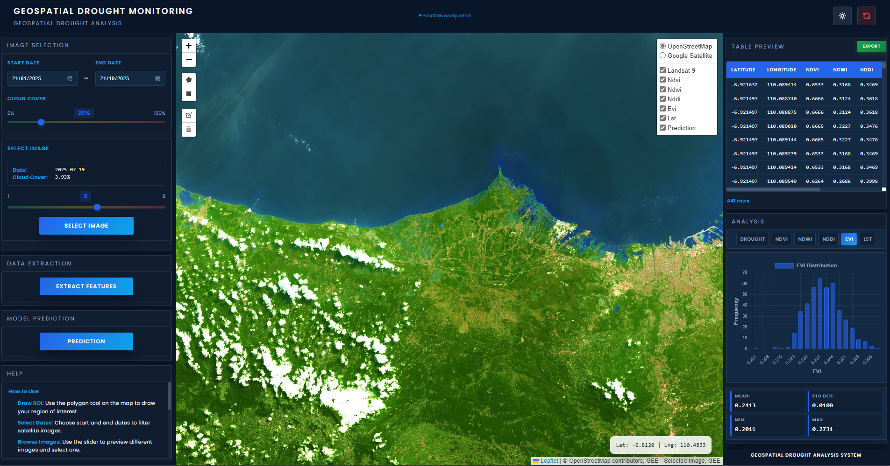

<h1 align="center">🌍 GEOSPATIAL DROUGHT MONITORING SYSTEM</h1>

<p align="center">
  
</p>

<p align="center">
  
  
  
  
  
</p>

---

## 📋 Daftar Isi

- [📖 Deskripsi Proyek](#-deskripsi-proyek)
- [✨ Fitur Utama](#-fitur-utama)
- [📁 Struktur Folder dan File](#-struktur-folder-dan-file)
- [⚙️ Requirements](#️-requirements)
- [🚀 Panduan Menjalankan Secara Lokal](#-panduan-menjalankan-secara-lokal)
  - [1. Clone Repository](#1-clone-repository)
  - [2. Buat Virtual Environment](#2-buat-virtual-environment)
  - [3. Instalasi Dependencies](#3-instalasi-dependencies)
  - [4. Konfigurasi secret-key.json dari GCP](#4-konfigurasi-secret-keyjson-dari-gcp)
  - [5. Jalankan Aplikasi](#5-jalankan-aplikasi)
- [🔑 Catatan Penting: secret-key.json](#-catatan-penting-secret-keyjson)

---

## 📖 Deskripsi Proyek

**Geospatial Drought Monitoring System** adalah aplikasi web berbasis **Remote Sensing** dan **Machine Learning** yang dirancang untuk mendeteksi dan mengklasifikasikan tingkat kekeringan di suatu wilayah secara spasial menggunakan citra satelit Landsat 9 dari **Google Earth Engine (GEE)**.

Aplikasi ini memungkinkan pengguna untuk:
- Menentukan wilayah pantau (*Region of Interest* / ROI) secara interaktif melalui peta
- Menelusuri dan memilih citra satelit Landsat berdasarkan rentang tanggal dan persentase tutupan awan
- Mengekstrak indeks geospasial terkait kekeringan (NDVI, NDWI, NDDI, EVI, LST)
- Menjalankan model prediksi Machine Learning untuk mengklasifikasikan tingkat kekeringan
- Memvisualisasikan hasil prediksi sebagai layer pada peta interaktif beserta grafik distribusi

Model prediksi menggunakan algoritma **Gradient Boosting / Random Forest Classification** (`scikit-learn`) dengan tiga kelas keluaran: **Low Drought**, **Medium Drought**, dan **High Drought**.

Link Website: https://afanr-remote-sensing.hf.space
---

## ✨ Fitur Utama

| No. | Fitur | Deskripsi |
|-----|-------|-----------|
| 1 | 🗺️ **Pemilihan Wilayah (ROI)** | Pengguna dapat menggambar poligon secara langsung pada peta interaktif (Leaflet.js) untuk mendefinisikan area yang ingin dianalisis |
| 2 | 🛰️ **Eksplorasi Citra Landsat 9** | Menampilkan daftar citra satelit yang tersedia pada rentang tanggal tertentu dengan filter persentase tutupan awan (*cloud cover*) |
| 3 | 📊 **Ekstraksi Indeks Geospasial** | Mengekstrak indeks spektral terkait kekeringan dari citra satelit, meliputi: **NDVI**, **NDWI**, **NDDI**, **EVI**, dan **LST** (Land Surface Temperature) |
| 4 | 🤖 **Klasifikasi Tingkat Kekeringan** | Memprediksi tingkat kekeringan menggunakan model Machine Learning (Gradient Boosting) dengan tiga kelas: *Low*, *Medium*, dan *High Drought* |
| 5 | 🖼️ **Visualisasi Layer Peta** | Menampilkan hasil prediksi dan setiap indeks geospasial sebagai layer *overlay* pada peta interaktif dengan palet warna yang khas |
| 6 | 🥧 **Grafik Distribusi (Pie Chart)** | Menampilkan distribusi statistik kelas kekeringan pada panel grafik menggunakan Chart.js |
| 7 | 💾 **Unduh Data CSV** | Pengguna dapat mengunduh hasil prediksi lengkap beserta nilai indeks geospasial dalam format CSV |
| 8 | 🏥 **Health Check API** | Endpoint `/api/health` untuk memantau status aplikasi dan status pemuatan model ML |

---

## 📁 Struktur Folder dan File

```
DroughtMonitoring/
│
├── assets/                     # Frontend (HTML, CSS, JavaScript)
│   ├── index.html              # Halaman utama aplikasi
│   ├── css/                    # File stylesheet
│   └── js/                     # File JavaScript
│
├── model/                      # Model Machine Learning
│   └── best_gb_model.joblib    # Model Gradient Boosting terlatih
│
├── utils/                      # Modul utilitas backend
│   ├── ee_init.py              # Inisialisasi & autentikasi Google Earth Engine
│   ├── extractor.py            # Kelas DroughtPredictor (ekstraksi fitur & prediksi)
│   └── maps.py                 # Kelas MapUtilsDrought (manajemen layer peta GEE)
│
├── images/                     # Aset gambar (screenshot, preview)
│
├── app.py                      # Entry point aplikasi Flask (REST API)
├── asgi.py                     # Konfigurasi ASGI (untuk deployment dengan Uvicorn)
├── requirements.txt            # Daftar dependensi Python
├── pyproject.toml              # Konfigurasi proyek Python
├── uv.lock                     # Lock file package manager uv
├── Dockerfile                  # Konfigurasi Docker untuk deployment
├── .dockerignore               # File yang dikecualikan dari Docker build
├── .env                        # Variabel lingkungan (tidak di-commit)
├── .gitignore                  # File yang dikecualikan dari Git
├── .gitattributes              # Konfigurasi atribut Git
├── .python-version             # Versi Python yang digunakan (3.11)
├── embed.md                    # Dokumentasi tambahan
│
└── secret-key.json             # ⚠️ KUNCI GCP (JANGAN DI-COMMIT ke GitHub!)
```

> **⚠️ Penting:** File `secret-key.json` **WAJIB** ada di direktori root proyek sebelum menjalankan aplikasi, namun **TIDAK BOLEH** diunggah ke GitHub. File ini sudah terdaftar di `.gitignore`.

---

## ⚙️ Requirements

### Prasyarat Sistem
- **Python** versi `3.11` (sesuai file `.python-version`)
- **pip** atau **uv** sebagai package manager
- Akun **Google Cloud Platform (GCP)** dengan akses ke **Earth Engine API**
- Koneksi internet aktif (untuk komunikasi dengan Google Earth Engine)

### Dependensi Python Utama

| Kategori | Library | Versi |
|----------|---------|-------|
| **Backend API** | `flask` | 3.1.2 |
| | `flask-cors` | 6.0.1 |
| | `werkzeug` | 3.1.3 |
| | `uvicorn` | ≥ 0.30.0 |
| **Data & ML** | `numpy` | ≥ 2.3.3 |
| | `pandas` | 2.3.3 |
| | `scikit-learn` | 1.7.2 |
| | `scipy` | 1.16.2 |
| | `joblib` | 1.5.2 |
| **Geospasial & GEE** | `earthengine-api` | 1.6.11 |
| | `geemap` | 0.36.4 |
| | `folium` | 0.20.0 |
| | `google-auth` | 2.41.1 |
| | `google-cloud-storage` | 3.4.1 |
| **Visualisasi** | `matplotlib` | 3.10.7 |
| | `pillow` | 11.3.0 |
| **Utilitas** | `requests` | 2.32.5 |
| | `openpyxl` | 3.1.5 |
| | `pyyaml` | 6.0.3 |

> Untuk daftar lengkap seluruh dependensi, lihat file [`requirements.txt`](./requirements.txt).

---

## 🚀 Panduan Menjalankan Secara Lokal

### 1. Clone Repository

Buka terminal dan jalankan perintah berikut untuk mengunduh kode sumber:

```bash
git clone https://github.com/pan-don/DroughtMonitoring.git
cd DroughtMonitoring
```

---

### 2. Buat Virtual Environment

Sangat disarankan menggunakan virtual environment agar dependensi proyek tidak bercampur dengan instalasi Python sistem Anda.

**Menggunakan `venv` (standar):**

```bash
# Buat virtual environment
python -m venv venv

# Aktifkan — Windows
venv\Scripts\activate

# Aktifkan — Linux / macOS
source venv/bin/activate
```

**Atau menggunakan `uv` (lebih cepat):**

```bash
# Install uv jika belum ada
pip install uv

# Buat dan aktifkan environment
uv venv
source .venv/bin/activate   # Linux/macOS
.venv\Scripts\activate      # Windows
```

---

### 3. Instalasi Dependencies

Setelah virtual environment aktif, install seluruh dependensi dari `requirements.txt`:

```bash
pip install -r requirements.txt
```

> Proses ini mungkin memakan waktu beberapa menit karena ukuran library geospasial (earthengine-api, geemap, dll.) yang cukup besar.

---

### 4. Konfigurasi `secret-key.json` dari GCP

> **⚠️ Langkah ini WAJIB dilakukan sebelum menjalankan aplikasi.**

Aplikasi ini terhubung ke **Google Earth Engine (GEE)** menggunakan autentikasi *Service Account* dari **Google Cloud Platform**. File kredensial ini bernama `secret-key.json` dan harus ditempatkan di **direktori root proyek**.

#### Cara Mendapatkan `secret-key.json`:

**Langkah 1 — Buat atau Pilih Proyek GCP**
1. Masuk ke [Google Cloud Console](https://console.cloud.google.com/)
2. Buat proyek baru atau pilih proyek yang sudah ada

**Langkah 2 — Aktifkan Google Earth Engine API**
1. Di GCP Console, navigasi ke **APIs & Services** → **Library**
2. Cari **"Earth Engine API"**
3. Klik **Enable**

**Langkah 3 — Daftarkan Proyek ke Earth Engine**
1. Buka [Earth Engine Code Editor](https://code.earthengine.google.com/)
2. Daftarkan Cloud Project Anda melalui menu **Assets** → **Cloud Projects**

**Langkah 4 — Buat Service Account**
1. Di GCP Console, navigasi ke **IAM & Admin** → **Service Accounts**
2. Klik **+ Create Service Account**
3. Isi nama dan deskripsi, lalu klik **Create and Continue**
4. Berikan role yang diperlukan (misalnya: **Earth Engine Resource Writer** atau **Earth Engine Resource Viewer**)
5. Klik **Done**

**Langkah 5 — Daftarkan Service Account ke Earth Engine**
1. Buka [Earth Engine Service Account Registration](https://signup.earthengine.google.com/#!/service_accounts)
2. Daftarkan email Service Account yang baru dibuat

**Langkah 6 — Buat dan Unduh Kunci JSON**
1. Di GCP Console, buka Service Account yang telah dibuat
2. Masuk ke tab **Keys**
3. Klik **Add Key** → **Create New Key**
4. Pilih format **JSON**, lalu klik **Create**
5. File JSON akan otomatis terunduh ke komputer Anda

**Langkah 7 — Tempatkan File di Proyek**
1. Ubah nama file yang diunduh menjadi `secret-key.json`
2. Pindahkan file ke **direktori root proyek** (sejajar dengan `app.py`)

```
DroughtMonitoring/
├── app.py
├── secret-key.json   ← letakkan di sini
├── requirements.txt
└── ...
```

> 🔒 **Keamanan:** Pastikan `secret-key.json` **tidak pernah diunggah** ke GitHub. File ini sudah tercantum di `.gitignore` secara default.

---

### 5. Jalankan Aplikasi

Setelah `secret-key.json` ditempatkan dengan benar dan semua dependensi terinstal, jalankan aplikasi dengan perintah:

```bash
python app.py
```

Anda akan melihat output seperti berikut di terminal:

```
============================================================
PRELOADING ML MODELS AT STARTUP
============================================================

[1/2] Loading Drought Predictor...
[OK] Drought Predictor ready

============================================================
MODEL PRELOADING COMPLETE
============================================================

 * Running on http://0.0.0.0:7860
 * Debug mode: on
```

Buka browser dan akses aplikasi di:

```
http://localhost:7860
```

atau

```
http://127.0.0.1:7860
```

> **Catatan:** Aplikasi berjalan pada port **7860** secara default (bukan port 5000). Pastikan port ini tidak sedang digunakan oleh proses lain di komputer Anda.

---

## 🔑 Catatan Penting: `secret-key.json`

| ✅ Yang Harus Dilakukan | ❌ Yang Tidak Boleh Dilakukan |
|------------------------|------------------------------|
| Simpan file di direktori root proyek | Jangan commit atau push ke GitHub |
| Jaga file tetap aman dan rahasia | Jangan bagikan ke publik |
| Backup file di tempat yang aman | Jangan letakkan di subfolder lain |
| Regenerate kunci jika dicurigai bocor | Jangan hardcode isinya di kode |

---

## 📡 Endpoint API

| Method | Endpoint | Deskripsi |
|--------|----------|-----------|
| `GET` | `/` | Halaman utama aplikasi |
| `GET` | `/api/health` | Status kesehatan aplikasi & model |
| `GET` | `/api/initial-layer` | Layer peta Landsat awal |
| `POST` | `/api/get-images` | Ambil daftar citra Landsat |
| `POST` | `/api/select-image` | Pilih dan muat citra tertentu |
| `POST` | `/api/extract` | Ekstrak indeks geospasial dari ROI |
| `POST` | `/api/predict` | Jalankan prediksi kekeringan |

---

## 🛠️ Teknologi yang Digunakan

| Layer | Teknologi |
|-------|-----------|
| **Frontend** | HTML5, CSS3, Vanilla JavaScript, Leaflet.js, Chart.js |
| **Backend** | Python 3.11, Flask, Flask-CORS |
| **Machine Learning** | scikit-learn (Gradient Boosting), joblib, NumPy, Pandas |
| **Remote Sensing** | Google Earth Engine API, geemap, folium |
| **Deployment** | Docker, Uvicorn (ASGI) |

---

<p align="center">
  Geospatial Project @2025
</p>